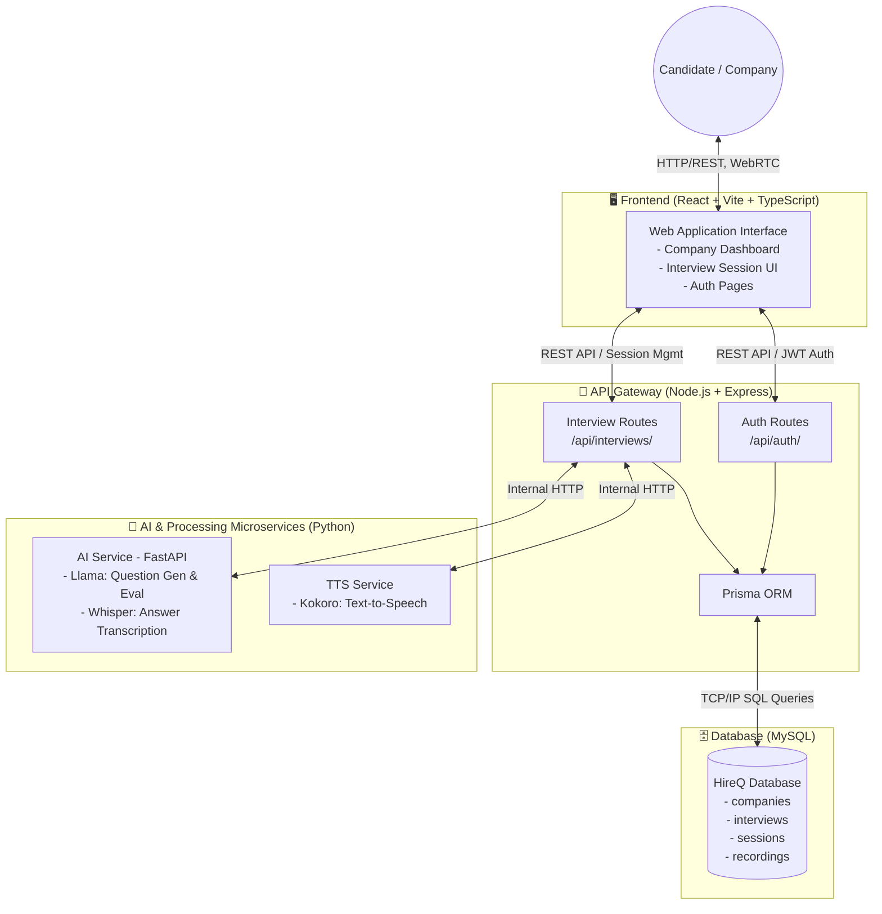
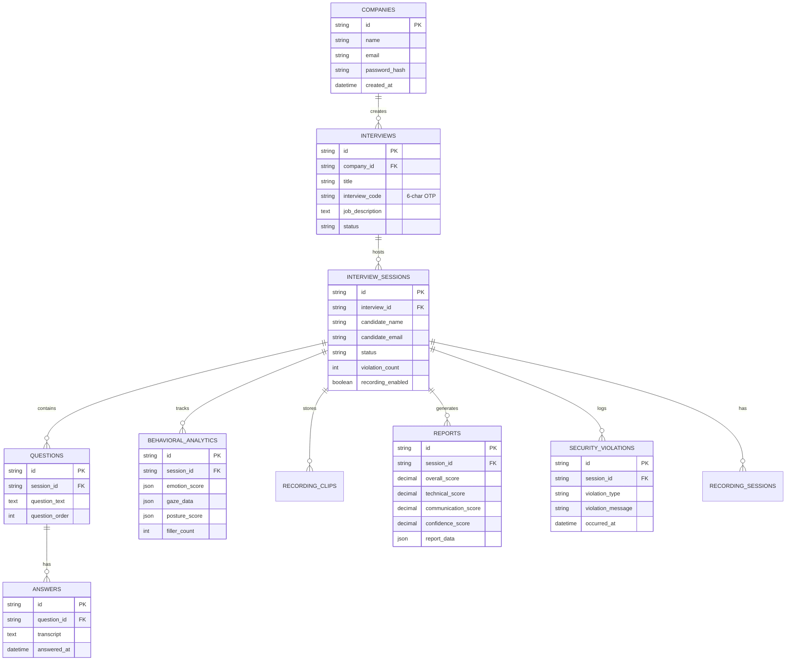

<div align="center">

# 🤖 HireQ

### AI-Powered End-to-End Interview Automation Platform

[](https://react.dev/)
[](https://www.typescriptlang.org/)
[](https://nodejs.org/)
[](https://fastapi.tiangolo.com/)
[](https://www.mysql.com/)
[](https://vitejs.dev/)

<br/>

> **HireQ** is a full-stack, microservices-based interview automation platform that leverages **AI-driven question generation**, **real-time speech transcription**, **text-to-speech delivery**, and **behavioral analytics** to streamline the end-to-end hiring process — from job posting to candidate evaluation.

<br/>

---

</div>

## 📋 Table of Contents

- [✨ Key Features](#-key-features)
- [🏗️ System Architecture](#️-system-architecture)
- [🗄️ Database Schema](#️-database-schema)
- [🧰 Tech Stack](#-tech-stack)
- [📁 Project Structure](#-project-structure)
- [⚙️ Setup & Installation](#️-setup--installation)
- [🚀 Running the Project](#-running-the-project)
- [🔌 API Reference](#-api-reference)
- [🤝 Contributing](#-contributing)

---

## ✨ Key Features

| Feature | Description |
|---|---|
| 🏢 **Company Dashboard** | Register, login, and manage all your open interview positions from a central dashboard |
| 🎯 **AI Question Generation** | Automatically generates role-specific interview questions using **Llama LLM** based on the job description |
| 🗣️ **Text-to-Speech Delivery** | Questions are read aloud to candidates in natural-sounding voice via the **Kokoro TTS** engine |
| 🎙️ **Speech-to-Text Transcription** | Candidate spoken answers are transcribed in real time through **OpenAI Whisper** |
| 📊 **Behavioral Analytics** | Tracks emotion, gaze, posture, speech patterns, and filler word usage throughout the interview |
| 🔒 **Security Monitoring** | Detects and records tab switches, focus loss, and other integrity violations during sessions |
| 📹 **Session Recording** | Video and audio are captured in rolling 15-second clips for post-session review |
| 📄 **Automated Reporting** | Generates comprehensive candidate reports with technical, communication, and confidence scores |
| 🔑 **OTP Interview Codes** | Unique 6-character codes let candidates join interviews without requiring an account |
| 🔐 **JWT Authentication** | Secure company authentication with bcrypt password hashing and JWT tokens |

---

## 🏗️ System Architecture

HireQ follows a **microservices architecture** with four core layers that communicate over REST/HTTP:



---

## 🗄️ Database Schema

The database is managed via **Prisma ORM** on top of **MySQL**. Below is the complete entity relationship map:



---

## 🧰 Tech Stack

### Frontend
| Technology | Version | Purpose |
|---|---|---|
| React | 19 | UI Framework |
| TypeScript | 5.9 | Type Safety |
| Vite | 7 | Build Tool & Dev Server |
| Tailwind CSS | 4 | Styling |
| Framer Motion | 12 | Animations |
| React Router DOM | 7 | Client-side Routing |
| Lucide React | Latest | Icon Library |
| Sonner | Latest | Toast Notifications |

### Backend — API Gateway
| Technology | Version | Purpose |
|---|---|---|
| Node.js + Express | 4 | REST API Server |
| TypeScript | 5.4 | Type Safety |
| Prisma ORM | 6 | Database Access Layer |
| MySQL2 | 3 | MySQL Driver |
| JSON Web Token | 9 | Authentication |
| Bcrypt | 6 | Password Hashing |
| ts-node-dev | 2 | Dev Hot Reload |

### Backend — AI Service
| Technology | Version | Purpose |
|---|---|---|
| Python | 3.10+ | Runtime |
| FastAPI | 0.111 | Async REST API |
| Uvicorn | 0.29 | ASGI Server |
| Llama (local) | — | Question Generation & Evaluation |
| OpenAI Whisper | — | Speech-to-Text Transcription |

### Backend — TTS Service
| Technology | Version | Purpose |
|---|---|---|
| Python | 3.10+ | Runtime |
| FastAPI | 0.111 | Async REST API |
| Kokoro TTS | — | Text-to-Speech Synthesis |
| httpx | 0.27 | Async HTTP Client |

### Database & Infrastructure
| Technology | Purpose |
|---|---|
| MySQL 8 | Primary relational database |
| Prisma | Schema management & ORM |
| XAMPP / MySQL local | Local development DB server |

---

## 📁 Project Structure

```
HireQ/
├── 📁 frontend/                    # React + TypeScript + Vite
│   ├── src/
│   │   ├── pages/
│   │   │   ├── Home.tsx            # Landing page
│   │   │   ├── auth/               # Login / Register pages
│   │   │   ├── company/            # Company dashboard & interview management
│   │   │   ├── candidate/          # Candidate join & interview flow
│   │   │   └── interview/          # Live interview session UI
│   │   ├── components/             # Shared reusable UI components
│   │   ├── lib/                    # Utility functions & API clients
│   │   └── types/                  # TypeScript type definitions
│   ├── index.html
│   └── package.json
│
├── 📁 backend/
│   ├── 📁 api-gateway/             # Node.js + Express REST API
│   │   ├── src/
│   │   │   ├── routes/
│   │   │   │   ├── auth.ts         # /api/auth — login, register
│   │   │   │   └── interviews.ts   # /api/interviews — CRUD & session mgmt
│   │   │   ├── middleware/         # JWT auth middleware
│   │   │   ├── prisma.ts           # Prisma client singleton
│   │   │   └── index.ts            # Express app entry point (port 3001)
│   │   └── prisma/
│   │       └── schema.prisma       # Full Prisma data model
│   │
│   ├── 📁 ai-service/              # Python FastAPI — Llama + Whisper
│   │   ├── app/
│   │   │   └── main.py             # FastAPI entry point
│   │   └── requirements.txt
│   │
│   └── 📁 tts-service/             # Python FastAPI — Kokoro TTS
│       ├── app/
│       └── requirements.txt
│
├── 📁 database/
│   ├── schema.sql                  # Raw MySQL schema (seed/init)
│   ├── migrations/                 # SQL migration files
│   └── seeds/                      # Sample data seeders
│
├── 📁 models/
│   └── TTS/                        # Kokoro TTS model weights
│
├── .gitignore
└── README.md
```

---

## ⚙️ Setup & Installation

### Prerequisites

Make sure you have the following installed before proceeding:

- **Node.js** `v18+` → [Download](https://nodejs.org/)
- **Python** `3.10+` → [Download](https://www.python.org/)
- **MySQL 8** (via XAMPP, Homebrew, or native install) → [Download XAMPP](https://www.apachefriends.org/)
- **Git** → [Download](https://git-scm.com/)

---

### 1. Clone the Repository

```bash
git clone https://github.com/DevShlok/HireQ.git
cd HireQ
```

---

### 2. Database Setup

#### a. Start your MySQL server
Start MySQL via **XAMPP Control Panel** or your system's MySQL service.

#### b. Create the database

```sql
CREATE DATABASE hireq_db;
```

#### c. Run the schema

```bash
mysql -u root -p hireq_db < database/schema.sql
```

> **Note:** If you'd prefer to use Prisma migrations instead, skip the above step and follow the Prisma migrate step below.

---

### 3. API Gateway (Node.js Backend)

```bash
cd backend/api-gateway
npm install
```

#### Configure Environment Variables

Create a `.env` file in `backend/api-gateway/`:

```env
# MySQL connection string
DATABASE_URL="mysql://root:<YOUR_PASSWORD>@localhost:3306/hireq_db"

# API Gateway port
PORT=3001

# JWT Secret (use a strong random string)
JWT_SECRET="your_super_secret_jwt_key"
```

> Replace `<YOUR_PASSWORD>` with your MySQL root password. If using default XAMPP with no password, leave it blank or omit it: `mysql://root:@localhost:3306/hireq_db`

#### Run Prisma Migrations

```bash
npx prisma migrate dev --name init
npx prisma generate
```

---

### 4. AI Service (Python — Llama + Whisper)

```bash
cd backend/ai-service

# Create and activate virtual environment
python -m venv venv

# Windows
venv\Scripts\activate

# macOS / Linux
source venv/bin/activate

# Install dependencies
pip install -r requirements.txt
```

> **Note:** You will need a locally running **Llama** model and **OpenAI Whisper** installed. Refer to their respective docs for model setup:
> - Llama: [Ollama](https://ollama.com/) is recommended for local model serving
> - Whisper: `pip install openai-whisper`

---

### 5. TTS Service (Python — Kokoro)

```bash
cd backend/tts-service

python -m venv venv

# Windows
venv\Scripts\activate

# macOS / Linux
source venv/bin/activate

pip install -r requirements.txt
```

> Ensure the **Kokoro TTS model weights** are placed in the `models/TTS/` directory. Download from the [Kokoro model repository](https://huggingface.co/hexgrad/Kokoro-82M).

---

### 6. Frontend (React + Vite)

```bash
cd frontend
npm install
```

#### Configure Environment Variables

Create a `.env` file in `frontend/`:

```env
VITE_API_URL=http://localhost:3001
VITE_AI_SERVICE_URL=http://localhost:8000
VITE_TTS_SERVICE_URL=http://localhost:8001
```

---

## 🚀 Running the Project

You need to start **4 services simultaneously** in separate terminal windows:

### Terminal 1 — API Gateway

```bash
cd backend/api-gateway
npm run dev
# Runs on http://localhost:3001
```

### Terminal 2 — AI Service

```bash
cd backend/ai-service

# Activate venv first
# Windows: venv\Scripts\activate
# macOS/Linux: source venv/bin/activate

uvicorn app.main:app --reload --port 8000
# Runs on http://localhost:8000
```

### Terminal 3 — TTS Service

```bash
cd backend/tts-service

# Activate venv first
# Windows: venv\Scripts\activate
# macOS/Linux: source venv/bin/activate

uvicorn app.main:app --reload --port 8001
# Runs on http://localhost:8001
```

### Terminal 4 — Frontend

```bash
cd frontend
npm run dev
# Runs on http://localhost:5173
```

### ✅ Service Health Check

| Service | URL | Status Endpoint |
|---|---|---|
| Frontend | http://localhost:5173 | — |
| API Gateway | http://localhost:3001 | `GET /health` |
| AI Service | http://localhost:8000 | `GET /docs` |
| TTS Service | http://localhost:8001 | `GET /docs` |

---

## 🔌 API Reference

### Auth Routes — `/api/auth`

| Method | Endpoint | Description | Auth |
|---|---|---|---|
| `POST` | `/api/auth/register` | Register a new company account | ❌ |
| `POST` | `/api/auth/login` | Login and receive JWT token | ❌ |

### Interview Routes — `/api/interviews`

| Method | Endpoint | Description | Auth |
|---|---|---|---|
| `POST` | `/api/interviews/create` | Create a new interview with JD | ✅ JWT |
| `GET` | `/api/interviews` | List all interviews for a company | ✅ JWT |
| `POST` | `/api/interviews/join` | Candidate joins via OTP code | ❌ |
| `POST` | `/api/interviews/start` | Start a session & generate AI questions | ❌ |
| `POST` | `/api/interviews/answer` | Submit a candidate answer | ❌ |
| `GET` | `/api/interviews/:id/report` | Fetch session report | ✅ JWT |

---

## 🤝 Contributing

Contributions are welcome! To contribute:

1. **Fork** the repository
2. Create a **feature branch**: `git checkout -b feature/your-feature-name`
3. **Commit** your changes: `git commit -m 'feat: add awesome feature'`
4. **Push** to the branch: `git push origin feature/your-feature-name`
5. Open a **Pull Request**

---

<div align="center">

Made with ❤️ by [DevShlok](https://github.com/DevShlok)

⭐ Star [this repo](https://github.com/DevShlok/HireQ) if you find it useful!

</div>
